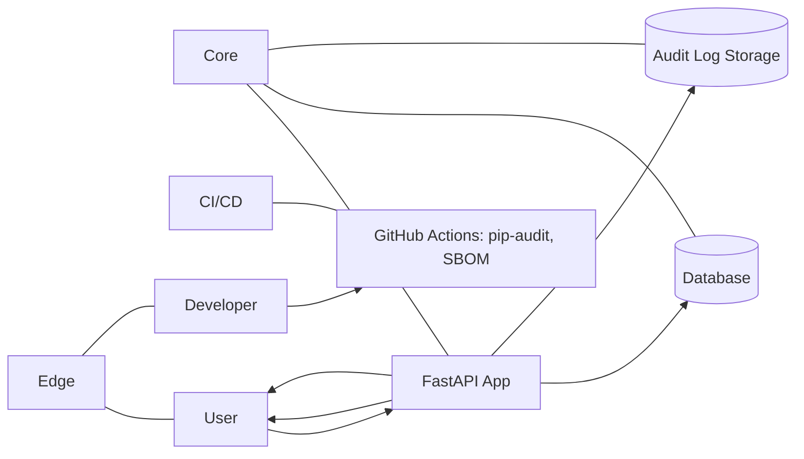

## Диаграмма (Mermaid)

## Список потоков
| ID | Откуда → Куда | Канал/Протокол | Данные/PII | Комментарий |
|----|---------------|-----------------|-----------|-------------|
| F1 | U → BFF       | HTTPS           | creds     |      Логин/получение/передача JWT; все защищённые вызовы идут с Authorization: Bearer.       |
| F2 | BFF → SVC     | mTLS            | session   |     Реверс-прокси/шлюз до FastAPI; лимитирование/логирование на периметре (если есть).        |
| F3 | SVC → DB      | TCP   (PSQL/SQLite)            | PII (имя пользователя), цели и KR        |     CRUD /objectives, /key-results, create_user, чтение.        |
| F4 | SVC → DB      | TCP   (PSQL)            | агрегированные данные       |     GET /stats — агрегации по Objective/KR.       |
| F5 | SVC → AUD     | TCP/append          | метаданные событий       |    Аудит login/CRUD/deny (non-repudiation).      |
| F6 | Developer → CI/CD (GitHub Actions) | HTTPS            | исходный код, зависимости | Проверка `pip-audit`, формирование SBOM, контроль supply chain. |
